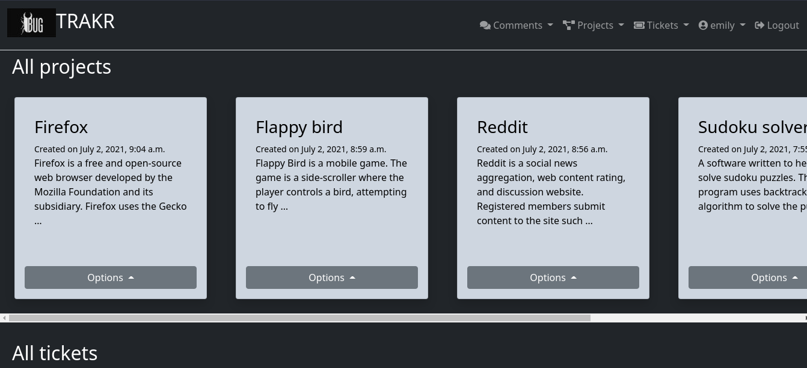

# Bugtrakr

> A simple tool to track your errors/bugs in your projects
[live link](https://bugtrakr.herokuapp.com)
https://bugtrakr.herokuapp.com

> Give heroku some time to start the server.

---

### Table of Contents

- [Description](#description)
- [Technologies](#technologies)
- [Installation](#installation)
- [Documentation](#documentation)
- [License](#license)

---

## Description

- A simple tool to manage issues/bugs in your organizational projects.
- Users can make an account or use the demo accounts to use the site.
- Users have roles (submitter, developer, project manager, admin)
- Manager, admins can create projects.
- Everyone can submit tickets for a projects.
- Members are assigned to resolve ticket.
- Automated mail is sent to the assigned members.
- The ticket status, priority and classification can be updated once it is resolved/reviewed.

---

#### Technologies

- Django
- Python
- Bootstrap
- Html/Css

[Back To The Top](#bugtrakr)

---

## Installation

- Clone the project.
- Create a virtual environment by using `python -m venv venv`.
- Activate the virtual environment.
- Install the required packages with `pip install -r requirements.txt`.
- Open the `.env.example` file and fill the asked information.
- Once the `.env.example` file is filled, rename it to `.env`.
- Open `tracker/settings.py` and change `DATABASES` dictionary with your database config.
- Migrate the database to the latest version by running `python manage.py migrate`.
- Create a `superuser` by running `python manage.py createsuperuser`.
- Provide the asked fields and create an account.
- Start the app by running `python manage.py runserver`.
- Open browser to address `localhost:8000`.

[Back To The Top](#bugtrakr)

---

## Documentation

The project is divided into modules
- Accounts
    - Create accounts
    - Edit accounts
    - Password change, reset functionality
    - Demo accounts
    - Roles for accounts

- Projects
    - Create projects
    - Edit projects
    - Assign users to projects
    - Archive projects

- Tickets
    - Create tickets
    - Edit tickets
    - Edit user to ticket
    - View ticket history
    - Send automated email to dependent users

- Comments
    - Create comments
    - Edit comments
    - Archive comments
    - Send automated mail to dependent users

---

## License

MIT License
[Read here](./LICENSE)

[Back To The Top](#bugtrakr)
